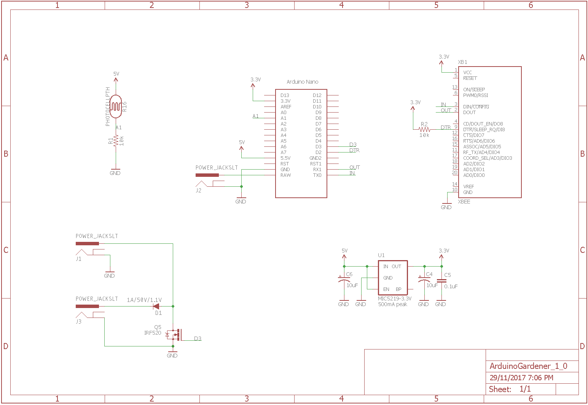

# Arduino Gardener
An Arduino based project for remotely watering plants on battery power. This project is part of a set of projects that allow you to water your garden remotely using a simple web page. The entire set of projects are contained in three repositories.
1. Arduing Gardener (this repo)
2. [Lumber Monkey](https://github.com/jonathanschoeller/LumberMonkey.Mqtt) (broker between your Arduino and an MQTT broker like AWS IoT)
3. [Gardener UI](https://github.com/jonathanschoeller/gardener-ui) (aka Swanky Monkey Garden - a Web interface for controlling everything)

## Building the Arduino Gardener
First, you will need to build the circuit shown below. The main components are an [Arduino Nano](https://www.arduino.cc/en/Guide/ArduinoNano) and a [Digi XBee S1 802.15.4 module](https://www.digi.com/support/productdetail?pid=3257).

[EAGLE Schematic File](ArduinoGardener_1_0.sch)
Most of the circuit should be pretty self-explanatory except for the three power plugs. Connect these power plugs as follows:

| Connector Name | Connect to    |
|----------------|---------------|
| J1             | 12V DC        |
| J2             | 12V DC        |
| J3             | Valve (12V)   |

The valve will be used to control the flow of water to your garden and should be closed when there is no current and open when 12 volts are applied.

## Programming the Arduino
To program the Arduino, just install the [gardener.ino](gardener.ino) sketch on your Arduino Nano using the Arduino IDE.

## How it Works
The Arduino Gardener uses the [CommandMessenger](https://github.com/thijse/Arduino-CmdMessenger) library to send and receive messages using the XBee. The Arduino will go into a low power mode for eight seconds, and then wake up and send a request for instructions over CommandMessenger. It will wait until it either receives an instruction, an indication that there are no instructions, or a timeout, and then go into low power mode for eight seconds and repeat.
If the Arduino Gardener receives an instruction to open the valve, it will open the connected valve for the amount of time specified in the instruction and then go back into low power mode and repeat.
The Gardener will also send light information collected by the photoresistor every few minutes.
